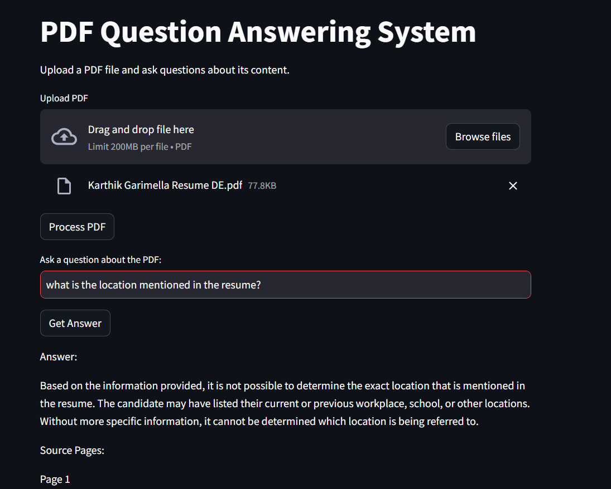
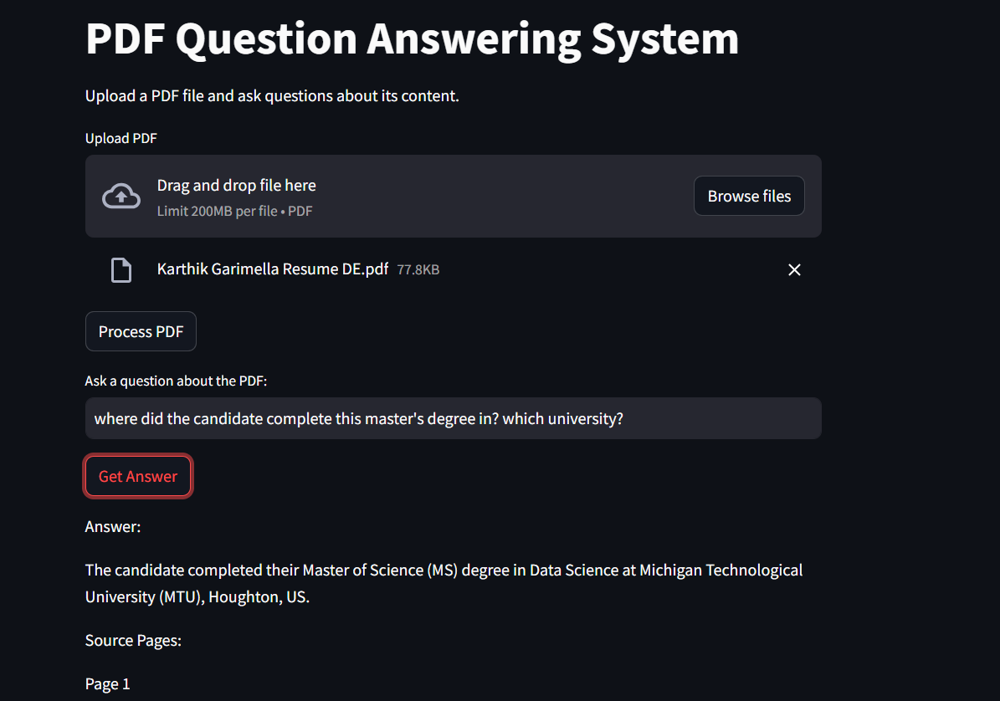

# PDF Question Answering System

This is a Streamlit application that allows you to upload PDF documents and ask questions about their content. The application uses a combination of sentence transformers for text embeddings and GPT4All (an open-source LLM) to provide answers based on the PDF content.

## Features

- Upload and process PDF documents
- Ask questions about the PDF content
- Get answers with source page references
- Uses local models (no API keys required)
- Efficient text search using FAISS

## Screenshots

### Upload PDF


### Process PDF


### Ask Questions and Get Answers




## Setup

1. Install the required dependencies:
```bash
pip install -r requirements.txt
```

2. Run the Streamlit application:
```bash
streamlit run app.py
```

## Usage

1. Open the application in your web browser (usually at http://localhost:8501)
2. Upload a PDF file using the file uploader
3. Click "Process PDF" to analyze the document
4. Enter your question in the text input field
5. Click "Get Answer" to receive a response

## Technical Details

- Uses Sentence Transformers for text embeddings
- FAISS for efficient similarity search
- GPT4All for local LLM inference
- PyPDF2 for PDF text extraction

## Note

The first time you run the application, it will download the required models which might take a few minutes depending on your internet connection. 
